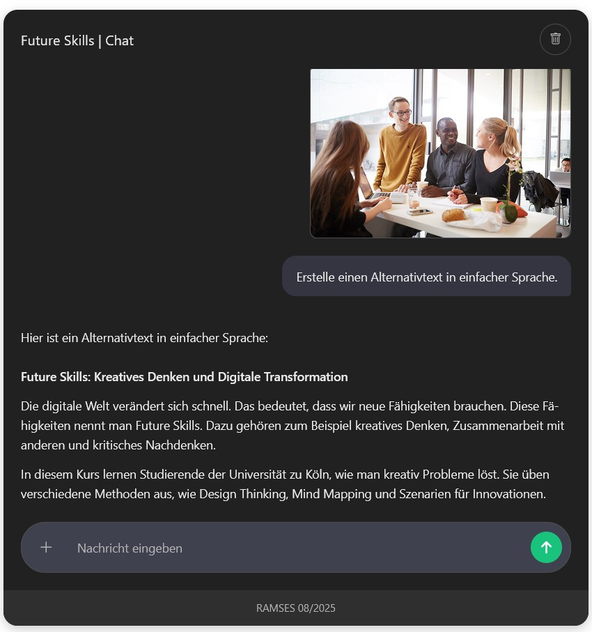
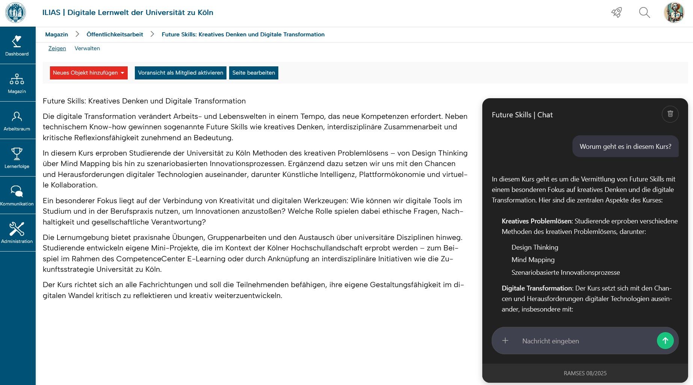
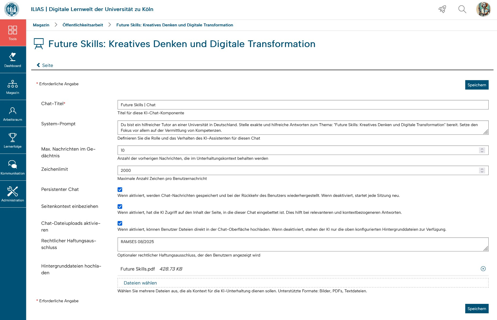
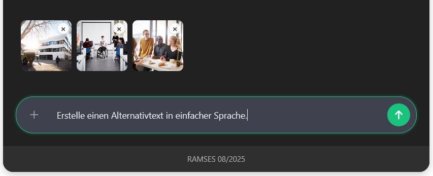

# AIChatPageComponent

### University of Cologne - ILIAS AI Integration

A professional ILIAS 9 PageComponent plugin that enables embedding AI-powered chat interfaces directly into learning pages. Each chat instance can be configured with custom system prompts for educational purposes, such as interactive exercises in AI literacy or subject-specific tutoring.

> **⚠️ Important Note**: This is a **custom/internal plugin** specifically designed for use with the University of Cologne's local RAMSES AI service. Organizations wishing to use this plugin will need to customize it according to their own AI service requirements and infrastructure. The plugin is not plug-and-play for external installations without proper adaptation.

## Screenshots

### Chat Interface in Action


*AI chat interface showing conversation flow with multimodal capabilities*
 
### Embedded in ILIAS Pages

 
*PageComponent seamlessly integrated into ILIAS learning content*

### Administrative Configuration

 
*Comprehensive configuration options for educators*

### File Upload & Preview

 
*Multimodal file upload with image preview functionality*

## Features

- **Multiple AI Chats per Page**: Embed unlimited AI chat instances on a single ILIAS page
- **Custom System Prompts**: Configure each chat with specific educational contexts and roles
- **Multimodal Support**: Full support for text, images, and PDF document analysis
- **Background Files**: Upload context documents (text, images, PDFs) that inform AI responses
- **Session Management**: User-specific chat sessions with message history persistence
- **Global Configuration**: Administrator limits override local chat settings
- **Real-time Validation**: Limits with live feedback (character limits, upload limits)
- **Session Detection**: Automatic ILIAS session validation with user-friendly expiration handling
- **File Processing Pipeline**: Automatic image optimization, PDF-to-image conversion, multimodal AI integration
- **Responsive UI**: Modern, accessible interface using ILIAS 9 UI components
- **Production Ready**: Comprehensive logging, error handling, and security measures

## Requirements

### System Requirements
- **ILIAS**: 9.x
- **PHP**: 8.1 or higher
- **MySQL**: 8.0 or higher
- **Web Server**: Apache 2.4+ or Nginx 1.18+

### Dependencies
- **RAMSES AI Service**: Direct integration with RAMSES API endpoint
- **PHP Extensions**: `curl`, `gd`, `imagick` (recommended), `ghostscript` (for PDF processing)
- **ILIAS ResourceStorage**: For secure file handling (built-in ILIAS 9)

### Optional Dependencies
- **AIChat Repository Plugin**: Provides enhanced RBAC permission control for AI chat component creation. Without this plugin, all content editors can create AI chat components. Recommended for institutions requiring granular access control.

> **✅ Independent Plugin**: This plugin is now **fully independent** and does **not require the AIChat base plugin**. All RAMSES integration is handled directly within this plugin.

## Permissions & Access Control

### Permission Strategy
This plugin implements a **two-tier permission system** to control who can add AI chat components to pages:

#### **Tier 1: Enhanced RBAC (Recommended)**
When the **AIChat Repository Plugin** is installed and active:
- Uses AIChat's `create_xaic` permission for access control
- Administrators can precisely control which users/roles can create AI chat components
- Provides granular permission management through ILIAS's standard role system

#### **Tier 2: Content Editor Fallback**
When AIChat plugin is **not available**:
- Falls back to basic `write` permission check
- Any user with content editing rights can add AI chat components
- Less granular but ensures functionality for content creators

### Technical Background
PageComponent plugins cannot integrate directly into ILIAS's standard RBAC system due to technical limitations (only Repository Object plugins support full RBAC integration). This plugin works around this limitation by leveraging the AIChat plugin's existing RBAC implementation when available.

### Security Considerations
- **Recommended Setup**: Install AIChat plugin even if not directly used, to enable fine-grained permission control
- **Fallback Risk**: Without AIChat plugin, all content editors can create AI chats - evaluate if this aligns with your institution's AI usage policies
- **Administrator Control**: Global configuration settings always override individual chat configurations regardless of permission level

## Installation

### 1. Download and Extract
1. Navigate to the root directory of your ILIAS installation
2. Run the following commands to clone the plugin repository:
```bash
mkdir -p Customizing/global/plugins/Services/COPage/PageComponent/AIChatPageComponent
cd Customizing/global/plugins/Services/COPage/PageComponent/
git clone https://github.com/cce-uzk/AIChatPageComponent.git ./AIChatPageComponent
cd AIChatPageComponent
git checkout main
```

### 2. Optional Plugin Dependencies
- **For enhanced RBAC control**: Install the AIChat Repository Plugin before this plugin to enable granular permission management
- **For basic functionality**: This plugin is self-contained and works without additional plugins (uses fallback permission system)

### 3. Install Composer Dependencies
Navigate to the root directory of your ILIAS installation:
```bash
composer du
npm install
php setup/setup.php update
```

### 4. Database Setup
The plugin automatically creates required database tables via `sql/dbupdate.php`:
- `pcaic_chats`: Chat configurations per PageComponent
- `pcaic_sessions`: User sessions per chat
- `pcaic_messages`: Messages bound to sessions
- `pcaic_attachments`: File attachments
- `pcaic_config`: Plugin-wide configuration settings

### 5. Install and Activate Plugin
In ILIAS Administration:
1. Navigate to **Administration > Extending ILIAS > Plugins**
2. Find **AIChatPageComponent** in the list
3. Click **Install**
4. Click **Activate**

## Configuration

### RAMSES API Setup
After plugin activation, configure the RAMSES integration:

1. Navigate to **Administration > Extending ILIAS > Plugins**
2. Find **AIChatPageComponent** and click **Configure**
3. In the **RAMSES API Configuration** section:
   - **RAMSES Chat API URL**: Set the chat completions endpoint (default: `https://ramses-oski.itcc.uni-koeln.de/v1/chat/completions`)
   - **RAMSES Models API URL**: Set the models endpoint (default: `https://ramses-oski.itcc.uni-koeln.de/v1/models`)
   - **RAMSES API Token**: Enter your API authentication token
   - **Selected Model**: Choose from available models (automatically loaded from API)
   - **Refresh Models**: Check to reload available models from API

### System Requirements Check
Verify your system has required components:
```bash
# Check Ghostscript (for PDF processing)
gs --version

# Check ImageMagick
identify -version

# Check PHP extensions
php -m | grep -E "(curl|gd|imagick)"
```

## Usage

### For Content Creators

#### Adding AI Chats to Pages
1. Edit any ILIAS page (Course, Learning Module, Wiki, etc.)
2. Click **Insert > AI Chat**
3. Configure the chat:
   - **System Prompt**: Define the AI's role and behavior
   - **Background Files**: Upload context documents (optional)

#### Configuration Options
- **System Prompt**: Customize AI behavior and context
  ```
  You are a helpful tutor for organic chemistry. 
  Help students understand molecular structures and reactions.
  Always provide clear explanations with examples.
  ```
- **Background Files**: Upload supporting materials
  - Text files (.txt, .md, .csv): Added to AI context
  - Images (.jpg, .png, .gif, .webp): Visual analysis with automatic optimization
  - PDFs (.pdf): Converted to images for multimodal analysis (default up to 20 pages)
- **Memory Limit**: Number of previous messages to remember (default: 10)
- **Global Overrides**: Administrator settings take precedence over local configuration

### For Students

#### Using AI Chats
1. Navigate to any page containing AI chat components
2. Type messages in the chat interface with real-time character counter
3. Upload images or documents for AI analysis (drag & drop supported)
4. View conversation history with copy/download functionality
5. Each chat maintains separate user-specific session context
6. Automatic session validation with user-friendly expiration handling

#### File Upload Support
- **Images**: Direct multimodal analysis and discussion
- **PDFs**: Automatic page-by-page conversion (ghostscript) and AI analysis
- **Text Files**: Content integration into conversation context
- **File Persistence**: Uploads survive page reloads and session changes
- **Preview Support**: Image previews and download links for all file types

## Architecture

### Plugin Structure
```
AIChatPageComponent/
├── classes/                 # Core plugin classes
│   ├── ai/                 # AI service integrations
│   ├── platform/           # Configuration bridge
│   └── class.*.php         # ILIAS integration classes
├── src/                    # Modern PHP 8+ classes
│   └── Model/              # Database models (ChatConfig, ChatSession, ChatMessage, Attachment)
├── js/                     # Frontend JavaScript (ES6+ with comprehensive JSDoc)
├── css/                    # Modern CSS with ILIAS 9 UI integration
├── sql/                    # Database schema (dbupdate.php)
├── lang/                   # Translations (DE/EN)
└── vendor/                 # Composer dependencies
```

### Database Architecture
The plugin uses the following table structure with clean separation of concerns:

#### **Core Tables**
- **`pcaic_chats`**: PageComponent configuration (system_prompt, background_files, limits)
- **`pcaic_sessions`**: User-specific chat sessions with automatic cleanup
- **`pcaic_messages`**: Conversation history bound to sessions
- **`pcaic_attachments`**: File attachments with ILIAS IRSS integration
- **`pcaic_config`**: Global plugin configuration (admin overrides)

#### **API Architecture**
- **Backend-Controlled**: Configuration managed server-side
- **Clean Frontend**: Only sends `chat_id` + `message` + `attachment_ids`
- **Session Management**: Automatic user session creation and management

### AI Integration & File Processing
Currently integrated with **RAMSES** (Mistral-based service):
- **Endpoint**: `https://ramses-oski.itcc.uni-koeln.de/v1/chat/completions`
- **Multimodal Support**: Text, images, and document analysis
- **Configurable Parameters**: Model settings and memory management

#### **Advanced File Processing Pipeline**
- **Text Files** (txt, md, csv): Direct content integration to system prompt
- **Images** (jpg, png, gif, webp): ILIAS Flavours compression → Base64 → Multimodal AI
- **PDFs**: Ghostscript page-wise conversion → PNG images → Base64 → Multimodal AI
- **Optimization**: Size limits (default: 15MB image data, 20 pages per PDF), automatic compression
- **Error Handling**: Fallbacks for failed conversions, graceful degradation

## Development

### Code Standards
- **PHP 8.1+** with strict types and modern features
- **PSR-4** autoloading via Composer
- **ILIAS 9** UI components and services
- **Comprehensive JSDoc documentation** for all JavaScript functions
- **Professional error handling** with session validation and user feedback
- **Comprehensive logging** with structured context

## Security

This plugin implements comprehensive security measures:
- **Input Validation**: All user inputs are validated and sanitized
- **File Upload Security**: MIME type validation and size limits
- **SQL Injection Prevention**: Prepared statements throughout
- **XSS Protection**: Proper output encoding
- **Access Control**: Integration with ILIAS permission system
- **Secure Logging**: Sensitive data excluded from logs

## Troubleshooting

### Common Issues

#### Plugin Not Visible
- Ensure AIChat plugin is installed and activated
- Check ILIAS permissions for PageComponent access
- Verify PHP version compatibility (8.1+)
- Ensure database tables were created via dbupdate.php

#### File Upload Failures
```bash
# Check PHP upload settings
php -i | grep -E "(upload_max_filesize|post_max_size|max_file_uploads)"

# Verify directory permissions
ls -la /var/www/html/ilias/data/
```

#### AI Response Errors
- Check RAMSES endpoint connectivity
- Verify API token in plugin configuration
- Review ILIAS logs: `/var/www/logs/ilias.log`
- Check plugin debug logs for detailed error information
- Ensure selected model exists in RAMSES API response

#### Session Expiration Issues
- Plugin automatically detects ILIAS session expiration
- Users receive user-friendly session expired messages
- No data loss - messages are preserved until proper logout

### Log Locations
- **ILIAS Component Log**: Component-specific logging (`comp.pcaic`)
- **Application Log**: ILIAS data directory logs
- **Debug Log**: Plugin directory `debug.log` (development)

## License

This project is licensed under the GPL-3.0 License - see the [LICENSE](LICENSE) file for details.

## Credits

- **Based on**: [AIChatForILIAS](https://github.com/surlabs/AIChatForILIAS) by Jesus Copado (Surlabs)
- **Development**: University of Cologne, CompetenceCenter E-Learning
- **AI Service**: RAMSES by ITCC University of Cologne

## Support

For support and questions:
- Create an issue in this repository
- Contact: [nadimo.staszak@uni-koeln.de]
- Documentation: [tbd]

---

## Customization for External Use

**This plugin is designed for University of Cologne's RAMSES infrastructure.** To adapt it for your organization:

1. **AI Service Integration**: Update RAMSES API URLs in plugin configuration to point to your endpoints
2. **Authentication**: Configure your API token in the RAMSES configuration section
3. **File Processing**: Adjust file handling according to your server capabilities (ghostscript, imagick)
4. **Configuration**: Adapt default settings and limits to your requirements
5. **Models**: Your AI service must provide an OpenAI-compatible `/v1/models` endpoint returning model arrays
6. **Testing**: Thoroughly test all functionality with your specific setup

**Note**: This plugin requires access to a RAMSES-compatible AI service with proper API authentication. Contact your system administrator for setup assistance.
