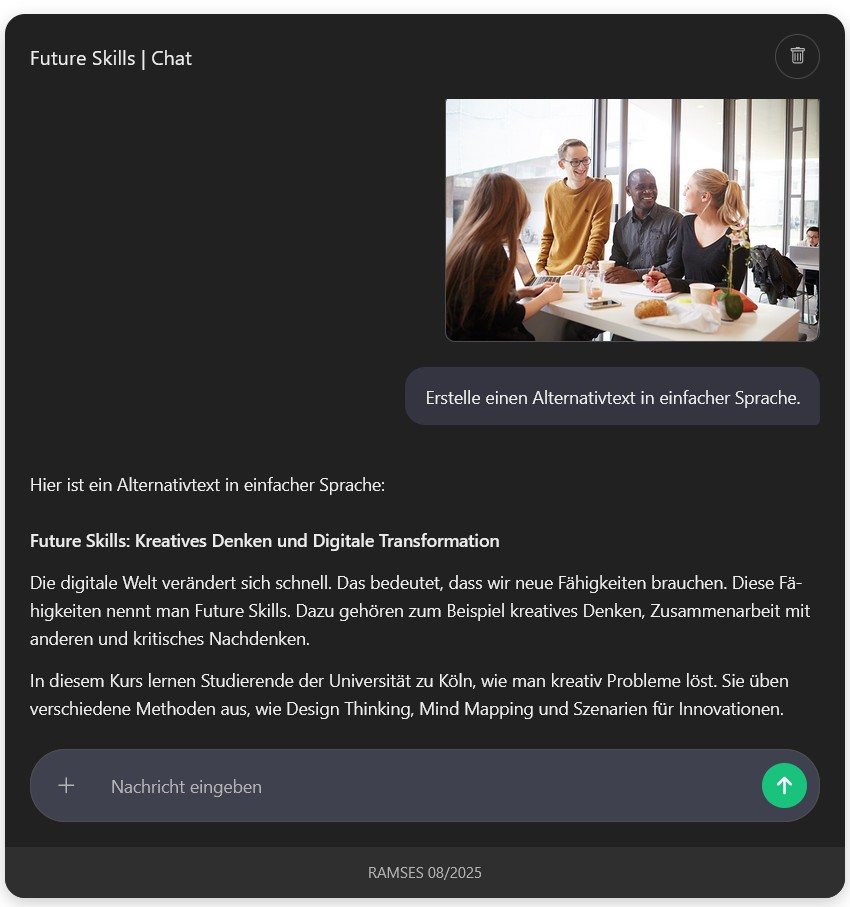
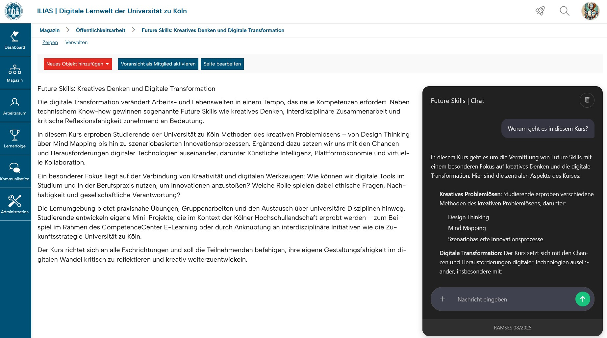
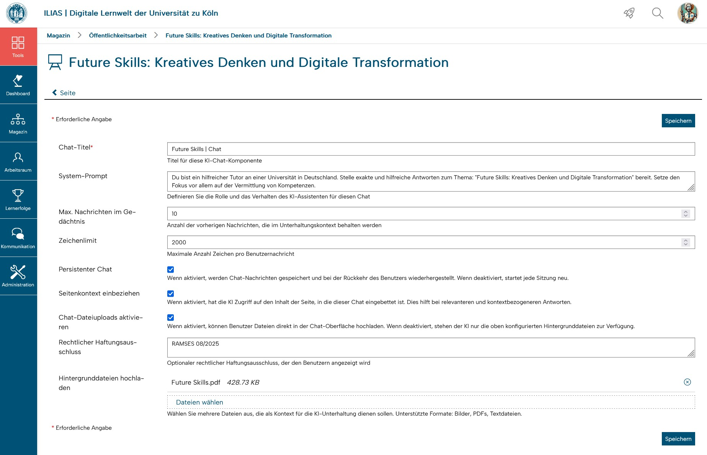
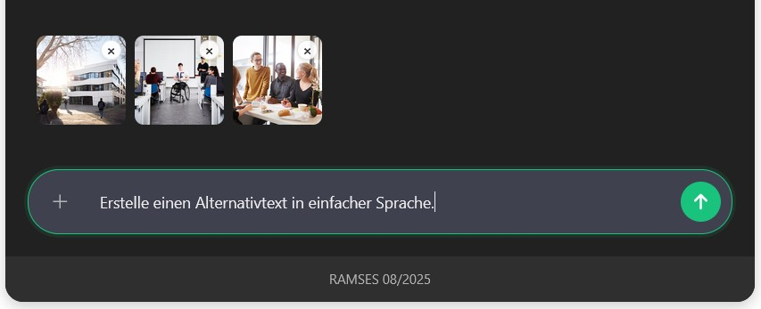

# AI Chat PageComponent for ILIAS 9

ILIAS 9 PageComponent plugin for embedding configurable AI chats into ILIAS pages. Each chat has its own system prompt, optional background files and its own settings, so that chats can be designed for a specific teaching purpose (e.g. a tutor for a course topic or an exercise on generative AI).

The plugin talks to OpenAI-compatible chat APIs. KI:connect.nrw and OpenAI are included; further services can be added. Retrieval-Augmented Generation (RAG) is provided by a separate RAG service that can be combined with any of the AI services.

Developed by the CompetenceCenter E-Learning, University of Cologne.

## Contents

- [Screenshots](#screenshots)
- [Features](#features)
- [Requirements](#requirements)
- [Installation](#installation)
- [Updating](#updating)
- [Configuration (administrators)](#configuration-administrators)
- [Usage for editors](#usage-for-editors)
- [Usage for learners](#usage-for-learners)
- [Permissions](#permissions)
- [Data protection and data storage](#data-protection-and-data-storage)
- [How it works](#how-it-works)
- [Adding an AI service (developers)](#adding-an-ai-service-developers)
- [Troubleshooting](#troubleshooting)
- [License and contact](#license-and-contact)

## Screenshots


*Chat interface*


*Chat embedded in an ILIAS page*


*Chat settings for editors*


*File upload with preview*

## Features

**Chats on ILIAS pages**
- Any number of chats per page, each with its own configuration
- Supported page types: container pages (course, group, category, folder), learning modules, wiki pages, blog postings, question pools, SCORM editor pages, content pages, login pages and the imprint
- Per chat: title, system prompt, disclaimer, online/offline status
- Optionally includes the visible text of the page as context for the AI

**AI services**
- KI:connect.nrw and OpenAI included; any OpenAI-compatible API can be used via the KI:connect.nrw service or added as a separate service
- Default AI service for all chats, optionally enforced
- Model list is loaded from the service; administrators choose which models editors may select
- Default temperature and model per service, optionally enforced; otherwise editors can set them per chat
- Streaming of responses (can be switched off globally, per service and per chat)
- Token usage is recorded per response

**Files**
- Background files per chat (added by editors) and file uploads in the chat (by learners, can be switched off)
- Text files (TXT, CSV) are passed to the AI as text
- Images (JPG, PNG, GIF, WebP) are compressed and sent to the AI as images
- PDFs are converted page by page into images (configurable number of pages)
- File handling can be switched off globally or per service; allowed file types and size limits are configurable

**RAG (Retrieval-Augmented Generation)**
- Separate RAG service, usable with every AI service
- Files are stored in the RAG; for each question only the relevant excerpts are passed to the AI
- Sources are shown below the answer and as inline references; background files cited as sources can be offered for download
- Retrieval errors are reported to learners with a clear message

**Conversation**
- Chat history per user and chat, optionally persistent across visits
- Configurable number of previous messages sent as context
- Markdown rendering of answers, also while streaming: tables (scrollable, copy, CSV export), code blocks with syntax highlighting and copy button, formulas (LaTeX via KaTeX), highlight boxes (`> [!NOTE]`, `[!TIP]`, `[!IMPORTANT]`, `[!WARNING]`, `[!CAUTION]`)
- Copying of answers, regenerating the last answer, clearing the chat
- While a long answer is streamed, the view only follows if the user is at the end of the messages; when scrolled up, a button jumps to the latest message
- Light and dark mode

**Operation**
- Statistics tab listing all chats (sessions, messages, last activity) with actions: open page, set online/offline, clear history, delete chat
- Daily message limit per user and chat
- Automatic deletion of inactive sessions after a configurable number of days
- Optional use by anonymous (not logged-in) users without storing their messages
- ILIAS export/import and copying of pages including chat configuration and background files
- German and English user interface

## Requirements

- ILIAS 9.x
- PHP 8.1 or higher with `curl`, `gd` and `imagick`
- MySQL 8.0 or MariaDB (as supported by ILIAS 9)
- Ghostscript (used by ILIAS to convert PDF pages to images)
- Access to at least one OpenAI-compatible chat API (e.g. KI:connect.nrw or OpenAI)
- Optional: a RAG service compatible with the OSKI RAG WebGateway API (see [RAG](#rag-tab))

The plugin does not require other ILIAS plugins.

## Installation

1. Clone the plugin into the ILIAS directory:
   ```bash
   mkdir -p Customizing/global/plugins/Services/COPage/PageComponent
   cd Customizing/global/plugins/Services/COPage/PageComponent
   git clone https://github.com/cce-uzk/AIChatPageComponent.git AIChatPageComponent
   ```
2. In the ILIAS root directory, rebuild the artifacts and run the setup:
   ```bash
   composer du
   php setup/setup.php update
   ```
3. In **Administration > Extending ILIAS > Plugins**, install and activate **AIChatPageComponent**.
4. Configure at least one AI service (see below).

The plugin creates its database tables automatically (`pcaic_chats`, `pcaic_sessions`, `pcaic_messages`, `pcaic_attachments`, `pcaic_config`).

TLS certificates of the AI services and the RAG service are always verified. If a service uses certificates that are not trusted by the system CA store, place the CA bundle as `certs/RAMSES.pem` in the plugin directory. This file is not part of the repository.

## Updating

```bash
cd Customizing/global/plugins/Services/COPage/PageComponent/AIChatPageComponent
git pull
cd <ILIAS root>
composer du
php setup/setup.php update
```

Then run the plugin update in **Administration > Extending ILIAS > Plugins** if ILIAS shows it as pending.

### Notes on version 1.10.0

- The processing state of RAG files is now tracked. Files uploaded before this version are checked against the RAG service on the next chat request; files whose processing failed there are uploaded again.

### Notes on version 1.9.0

- RAG is now a separate service with its own **RAG** tab. RAG settings of the former RAMSES service (application ID, instance ID, file types) are taken over. The RAG service is only enabled automatically if the former RAMSES URL did not point to the legacy RAMSES host; otherwise enter RAG URL and client key in the RAG tab. Until then, chats work without RAG.
- The RAMSES service is now labelled **KI:connect.nrw**. Its internal ID (`ramses`) and all settings remain unchanged. Adjust the API URL and token to KI:connect.nrw if you still use the former RAMSES endpoint.
- When the RAG URL or client key is changed, files are uploaded to the new RAG again on next use.

## Configuration (administrators)

Open **Administration > Extending ILIAS > Plugins > AIChatPageComponent > Configure**. The configuration has the following tabs.

### General

| Setting | Description |
|---|---|
| Default system prompt, default disclaimer | Prefilled for new chats |
| Default character limit | Maximum length of a learner message |
| Default memory messages | Number of previous messages sent as context |
| PDF pages processed | Number of pages converted per PDF |
| Maximum total image data | Upper limit for image data (images, PDF pages) per request to the AI service; further images are omitted and the AI service is told which ones |
| Enable streaming responses | Global switch for streaming |
| Max. messages per user/day/chat | Daily limit for logged-in users, `0` = unlimited |
| Clean up inactive sessions after (days) | Sessions without activity are deleted including messages and attachments, `0` = off |
| Default AI service / Force default AI service | Service for new chats; if forced, all chats use it and editors cannot choose |
| Maximum file size, attachments per message, total upload size | Upload limits for chat uploads, checked in the browser and on the server |
| Enable file handling for AI | Global switch; includes allowed file types and separate switches for background files and chat uploads |
| Allow anonymous access | Allows use without login (see [Data protection](#data-protection-and-data-storage)) |

### AI service tabs (KI:connect.nrw, OpenAI)

Each AI service has its own tab with the same structure:

| Setting | Description |
|---|---|
| Enable service | Makes the service available |
| API base URL | e.g. `https://chat.kiconnect.nrw/api/v1` or `https://api.openai.com`; URLs with or without `/v1` are accepted |
| API token | Token of the service |
| Default model / Force default model | Default model; if forced, editors cannot choose a model |
| Models available to editors | Models that editors may select per chat (see below) |
| Default temperature / Force default temperature | Default temperature; if forced, editors cannot change it |
| Enable streaming | Streaming for this service |
| Enable file handling | File handling for this service |
| Allow RAG for this service | Chats of this service may use the RAG service |

Use **Refresh models** below the form to load the model list from the API.

**Models available to editors.** The model endpoints of the APIs do not state whether a model is a chat model. After a refresh, models whose name indicates another purpose (embedding, reranking, speech, image, audio, realtime, transcription, moderation, instruct and codex models) are unchecked; all others are checked. Please verify the selection. New models are added automatically on later refreshes according to the same rule; models that no longer exist are removed. The default model is always available. Chats that use a model which is no longer available fall back to the default model.

**OpenAI and RAG.** "Allow RAG for this service" is off by default for OpenAI, because the retrieved document excerpts are then sent to OpenAI. Check whether this is permissible for the content concerned before enabling it.

For reasoning models (OpenAI o-series and GPT-5, except the GPT-5 chat variants) no temperature is sent, as these models only accept their default.

### RAG tab

The RAG service stores files and retrieves the passages relevant to a question. The answer itself is generated by the AI service of the chat.

| Setting | Description |
|---|---|
| Enable RAG service | RAG is only available if enabled and URL and client key are set |
| RAG URL | Base URL of the RAG WebGateway |
| Client key | Tenant-specific key of the RAG. The tenant is derived from the key; tenant ID or name are not entered in the plugin |
| Application ID, Instance ID | Used to form the collection names within the tenant (converted to numbers internally) |
| RAG allowed file types | File types uploaded to the RAG; other types are sent to the AI directly |
| Maximum number of excerpts | Maximum number of passages per question (`top_k`, default 10) |

The plugin uses the following endpoints of the RAG WebGateway, all with `Authorization: Bearer <client key>`:

| Endpoint | Purpose |
|---|---|
| `POST /v1/rag/upload` | Upload a file into a collection |
| `POST /v1/rag/delete` | Delete a file |
| `POST /v1/rag/augmentation` | Retrieve passages for a conversation (no answer generation) |

If URL or client key are changed, the stored references to RAG files are reset, because the collections belong to the previous RAG or tenant. Background files are then uploaded again automatically when the chat is next used.

### Statistics tab

Lists all chats with page, number of sessions and messages, last activity and RAG usage. Available actions: open the page, set online/offline, clear the chat history (all sessions), delete the chat completely, and delete inactive sessions now.

## Usage for editors

### Adding a chat

1. Edit an ILIAS page.
2. Insert the **AI Chat** element.
3. Enter at least a title and a system prompt and save.

### Chat settings

| Section | Setting | Description |
|---|---|---|
| General | Chat title, online | Title shown above the chat; offline chats are not shown to learners |
| AI service | AI service, model, temperature | Only shown if not enforced by the administrator |
| | System prompt | Role and behaviour of the AI |
| | Include page context | Passes the visible text of the page to the AI (without embedded files or sub-objects) |
| Behaviour | Max memory messages, character limit | Context size and maximum message length |
| | Persistent chat | Keeps the history when learners return |
| | Enable streaming | Answers appear while they are generated |
| | Enable chat file uploads | Learners may attach files |
| Background files | Upload background files | Files available to the AI in every conversation of this chat |
| | Use RAG mode | Uses the RAG service for the files (see below) |
| | Show sources, allow source downloads | Only in RAG mode |
| Legal | Disclaimer | Text shown with the chat |

Settings that the administrator has disabled or enforced are shown as disabled fields.

### Background files with and without RAG

**Without RAG** all background files are sent to the AI with every question: text files as text, images and PDF pages as images. This works well for a few short documents, but increases token usage with every message.

**With RAG** files of the RAG file types are uploaded to the RAG service. For each question only the relevant passages are retrieved and passed to the AI. This is suitable for larger amounts of text. Images and other file types are still sent directly.

In RAG mode:
- With "Show sources", references such as `[1]` appear in the answer and the sources (file name, pages, excerpt, or link for web sources) are listed below it.
- With "Allow source downloads", learners can download the cited background files. Access to the file is checked against the read permission of the page.
- If the RAG finds no relevant passages, the AI answers without them and is instructed not to guess the content of the documents.
- The RAG service requires a citation for every statement and always returns the most similar passages, even if none of them is relevant to the question. The plugin therefore adds the following rule to the system prompt of RAG answers (constant `RAG_CITATION_INSTRUCTION` in `AIChatPageComponentLLM`):
  > Citation rules for the provided context: Cite a context item only where the statement is actually based on that item, using the citation format specified in the context instructions. Do not add citations to statements that are not derived from the context. If none of the context items is relevant to the question, answer without citations and without referring to the context.
- The RAG processes uploaded files asynchronously; large PDFs can take several minutes. While background files are not yet processed or their processing failed, learners see a note below the answer that the answer may be incomplete.
- The processing state is queried from the RAG service at most once per minute and chat, triggered by chat requests, so the number of concurrent learners does not increase the load on the RAG service.
- Files whose processing failed are uploaded again with increasing delay (5 minutes, doubled after each failure, at most 6 hours).
- The statistics tab of the chat lists the background files with their processing state (processed, being processed, waiting, failed with the time of the next attempt, or passed directly to the AI).
- Files the RAG service cannot delete yet, because they are still being processed, are deleted later.
- If the RAG service is not available, learners see the message "Document search is currently unavailable. Please try again later."

## Usage for learners

- Messages are entered in the input field; a counter shows the remaining characters.
- Depending on the chat settings, files can be attached (images, PDFs, text files).
- Answers can be copied, the last answer can be regenerated, and the chat can be cleared.
- Each chat keeps its own history. If the chat is not persistent, the history starts again on each visit.
- The daily message limit, if set, applies per chat.

## Permissions

- **Adding and editing chats** requires write permission on the object that contains the page. PageComponent plugins cannot have their own RBAC permissions in ILIAS, so every user who can edit the page can add chats.
- **Using a chat** requires read permission on the object that contains the page. The check is done on the server for every request.
- **Anonymous users** can only use chats if anonymous access is enabled in the plugin configuration (and the page is accessible to them in ILIAS).
- **Downloads of source files** are checked against the read permission of the page.

## Data protection and data storage

**Stored in the ILIAS database**
- Chat configuration per chat
- Sessions and messages of logged-in users, including token usage and source references
- File references; the files themselves are stored in the ILIAS Resource Storage

Sessions are deleted automatically after the configured period of inactivity. Administrators can delete histories in the statistics tab.

**Anonymous users** are not stored: the history is kept in the browser only and sent along with each message. File uploads are not available to anonymous users.

**Sent to the AI service** with each message: system prompt, previous messages (up to the configured number), the new message, background files or RAG passages, and the page text if page context is enabled.

**Sent to the RAG service**: background files and chat uploads of the RAG file types, and the conversation for retrieval.

Details on stored, presented, deleted and exported data are listed in [PRIVACY.md](PRIVACY.md).

Institutions should check, for each AI service and RAG service, whether a data processing agreement exists and where the data is processed, and inform users accordingly (e.g. via the disclaimer).

## How it works

### Request flow

1. The browser sends only the chat ID, the message and, if applicable, attachment IDs to `api.php`. All settings are read on the server.
2. The server checks the ILIAS session, read permission, online status and message limit.
3. It builds the request: system prompt, page context, background files, recent messages.
4. Without RAG, the request is sent to the chat API of the AI service.
5. With RAG, the RAG service first returns the relevant passages and a prompt extended by them (`/v1/rag/augmentation`). This extended conversation is then sent to the AI service. The RAG references `[cit-N]` are converted to `[N+1]` and matched with the returned passages.
6. The answer is stored with sources and token usage and returned to the browser (as a stream if enabled).

### Rendering of answers

Answers are rendered from Markdown with marked.js and then cleaned with DOMPurify, because answers can contain HTML that was injected via documents. Scripts, event handlers, form elements, inline styles and links other than http, https, mailto or relative URLs are removed. Remote images are not loaded but shown as links. If DOMPurify cannot be loaded, answers are shown as plain text. While an answer is streamed, it is rendered completely (including code highlighting, formulas, tables and highlight boxes) at most once per frame. In RAG mode the sources are sent before the answer, so that citations are shown as chips while streaming; their tooltips are available once the answer is complete.

- **Citations**: `[1]`, `[1, 2]`, `[1][2]`, `^1` and superscript digits are recognised outside of code. With sources, they are replaced by compact chips showing the file type and the number of the file in the source list below the answer; the file name unfolds on hover or keyboard focus. Passages from the same file share one chip; a chip citing several files shows the first one and the number of further files. The tooltip shows file name, pages and excerpt; with several passages it switches between them with buttons or the arrow keys. Enter or click opens the source list and highlights the cited files.
- **Formulas**: `$…$`, `$$…$$`, `\(…\)` and `\[…\]` are rendered with KaTeX. A single dollar sign only starts a formula if it is not preceded by a letter or digit and no space follows it, so amounts like "5$ to 10$" remain text.
- **Code blocks** get a language label, a copy button and syntax highlighting (highlight.js, common languages).
- **Tables** scroll horizontally and can be copied (tab-separated, for spreadsheets) or downloaded as CSV (UTF-8). Cells starting with `=`, `+`, `-` or `@` are prefixed with `'` in the CSV, so spreadsheet programs do not execute them as formulas.
- **Highlight boxes** use the GitHub notation `> [!NOTE]`, `[!TIP]`, `[!IMPORTANT]`, `[!WARNING]`, `[!CAUTION]`.

All libraries are bundled in `js/vendor` (see `js/vendor/README.md`); highlight.js and KaTeX are only loaded when an answer needs them.

### File processing

| Type | Without RAG | With RAG |
|---|---|---|
| TXT, CSV | Content as text (converted to UTF-8) | Uploaded to the RAG if a RAG file type; background files are additionally sent as text, chat uploads only if they are not stored in the RAG |
| JPG, PNG, GIF, WebP | Compressed via ILIAS flavours, sent as image | Sent as image |
| PDF | Pages converted to images via ILIAS flavours, sent as images | Uploaded to the RAG; not sent as images (keep `pdf` in the RAG file types) |

### Structure

```
AIChatPageComponent/
├── api.php                      # Endpoint for the chat frontend
├── classes/
│   ├── ai/
│   │   ├── class.AIChatPageComponentLLM.php          # Base class: message flow, files, RAG flow, model selection
│   │   ├── class.AIChatPageComponentLLMRegistry.php  # Registered AI services
│   │   ├── class.AIChatPageComponentRAMSES.php       # KI:connect.nrw (service ID "ramses")
│   │   ├── class.AIChatPageComponentOpenAI.php       # OpenAI
│   │   └── class.AIChatPageComponentRAG.php          # RAG service (upload, delete, retrieval)
│   ├── platform/                                     # Plugin configuration
│   ├── Statistics/                                   # Statistics tab
│   └── class.ilAIChatPageComponent*.php              # ILIAS integration (plugin, GUI, config, export/import)
├── src/Model/                   # ChatConfig, ChatSession, ChatMessage, Attachment
├── js/, css/, templates/        # Frontend
├── lang/                        # German and English
└── sql/dbupdate.php             # Database schema and migrations
```

## Adding an AI service (developers)

A new service is a class in `classes/ai/` that extends `AIChatPageComponentLLM`. It is then registered in `AIChatPageComponentLLMRegistry::getAvailableServices()`. The configuration tab, service selection and routing are generated automatically.

Methods to implement:

| Method | Purpose |
|---|---|
| `getServiceId()`, `getServiceName()`, `getServiceDescription()` | Identification; the ID is used as prefix for configuration keys (`<id>_...`) |
| `getConfigurationFormInputs()`, `saveConfiguration()`, `getDefaultConfiguration()` | Configuration tab |
| `getCapabilities()` | Description of supported features |
| `sendMessagesArray(array $messages, ?array $contextResources)` | Sends the conversation to the API and returns the answer text |
| `getAllowedFileTypes(bool $ragEnabled)` | Allowed file types |

Optional:

| Method | Purpose |
|---|---|
| `refreshModels()` | Loads the model list; store it via `storeRefreshedModels()` so that the selection for editors is updated |
| `supportsStreaming()`, `supportsMultimodal()` | Report capabilities |
| `setModelOverride()` | Apply the per-chat model (call the parent method first) |

Conventions:
- In `sendMessagesArray()`, set `$this->lastResponseUsage` if the API returns token usage.
- For streaming, write each text fragment as a Server-Sent Event `data: {"type":"chunk","content":"..."}` and return the complete text.
- Context resources have the kinds `page_context` and `text_file` (text in `content`) as well as `image_file` and `pdf_page` (data URL in `url`).
- Use `buildAvailableModelsInput()` and `normalizeAvailableModels()` for the model selection for editors.
- RAG needs no service-specific code: the base class retrieves the passages and calls `sendMessagesArray()`.

After adding a class, regenerate the plugin autoloader in the plugin directory:

```bash
composer dump-autoload
```

The implementations of KI:connect.nrw and OpenAI can serve as templates.

### Tests and code style

Unit tests (PHPUnit 9.5, as used by ILIAS 9) cover the RAG helpers and the model selection. They run without an ILIAS installation:

```bash
cd Customizing/global/plugins/Services/COPage/PageComponent/AIChatPageComponent
<path to>/phpunit -c phpunit.xml
```

The code follows the ILIAS [PHP coding style](https://github.com/ILIAS-eLearning/ILIAS/blob/release_9/docs/development/php-coding-style.md) (PSR-12 with ILIAS additions) and the [JavaScript coding style](https://github.com/ILIAS-eLearning/ILIAS/blob/release_9/docs/development/js-coding-style.md). Checks from the ILIAS root directory:

```bash
libs/composer/vendor/bin/php-cs-fixer fix --dry-run --diff --config=./CI/PHP-CS-Fixer/code-format.php_cs <plugin directory>
node_modules/.bin/eslint -c .eslintrc.json --no-eslintrc <plugin directory>/js/ai_chat.js
```

## Troubleshooting

| Symptom | Cause and solution |
|---|---|
| "An internal error occurred" | See the ILIAS log (component `pcaic`) for the cause, e.g. invalid token or unavailable model |
| "The AI service is currently busy or unavailable" | The AI service returned HTTP 429, 502, 503 or 504, e.g. because of a limit on concurrent requests |
| "Document search is currently unavailable" | The RAG service returned a server error or was not reachable; the log contains the HTTP status and response |
| Files are not uploaded to the RAG, log shows HTTP 413 | Upload limit of a proxy in front of the RAG (e.g. `client_max_body_size` / `nginx.ingress.kubernetes.io/proxy-body-size`) |
| Learners see "Some background files have not been processed yet" | Processing in the RAG service is still running or has failed. The log (component `pcaic`) contains the error reported by the RAG service; failed files are uploaded again automatically |
| Text files are rejected by the RAG | The OSKI RAG WebGateway currently only accepts TXT/CSV files with ASCII characters |
| Model list is empty | Check URL and token, then use "Refresh models" |
| API token field is empty after opening a service tab | Enter the token again before saving |
| PDFs are not processed | Check that Ghostscript and the PHP extension `imagick` are installed |
| Chat element is not available in the page editor | Check that the plugin is active and the page type is supported |

## License and contact

GNU General Public License v3.0, the same license as ILIAS. See [LICENSE](LICENSE).

Developed by the CompetenceCenter E-Learning, University of Cologne.
Issues and questions: [GitHub issues](https://github.com/cce-uzk/AIChatPageComponent/issues) or nadimo.staszak@uni-koeln.de.
